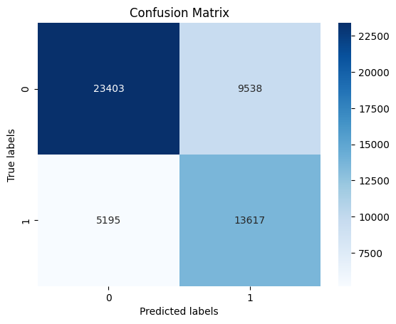
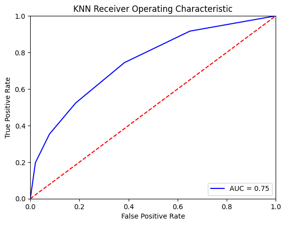
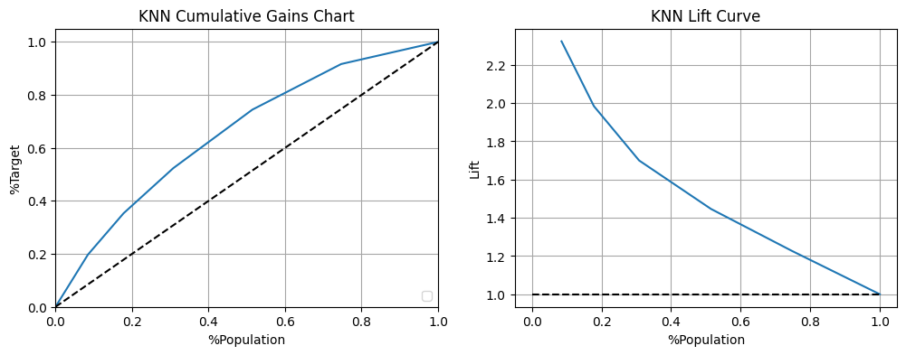

# Lobbying Prediction Model

A machine learning project that predicts lobbying success using Canadian lobbying registrations data. The model determines whether a lobbying attempt will receive government funding based on features such as subject matter, registrant location, organizational structure, and target institution.

## 📊 Results

### Model Performance (Random Forest Classifier)

| Metric | Score |
|--------|-------|
| **Accuracy** | 71.5% |
| **Precision** | 70.3% |
| **Recall** | 71.7% |
| **F1 Score** | 70.5% |

### Key Findings
When predicting government funding success (Class = 1), the model identified these top predictive features:

- **Subject Matter**: Budget (8.0%), Economic Development (7.8%), Infrastructure (5.9%)
- **Target Institution**: Natural Resources Canada (44.8%), Finance Canada (25.1%), Agriculture Canada (11.1%)
- **Region (Area Code)**: Ottawa-613 (45.8%), Toronto-416 (24.5%)

### Visualizations

#### Confusion Matrix


#### ROC Curve


#### Model Performance Charts


## 🔧 Features

- **Data Preprocessing**: Handling missing values with imputation, encoding categorical features, feature scaling with StandardScaler
- **Class Imbalance Handling**: RandomUnderSampler to address 33/67 class distribution
- **Multiple Models**: Logistic Regression, Random Forest, Gradient Boosting, XGBoost
- **Evaluation Metrics**: Accuracy, Precision, Recall, F1-Score, Confusion Matrix, ROC Curve, Lift Chart, Cumulative Gains

## 📁 Project Structure

```
LobbyingPredictionModel/
├── lobbyingModel.ipynb    # Main Jupyter notebook with analysis
├── canadacities.csv       # Canadian cities reference data
├── images/                # Visualization outputs
│   ├── confusion_matrix.png
│   ├── roc_curve.png
│   └── cumulative_gains_lift.png
├── requirements.txt       # Python dependencies
├── LICENSE               # MIT License
└── README.md             # This file
```

## 📥 Data

### Primary Dataset (Not Included)
The primary dataset `merged lobby.csv` (~995K rows) is not included due to file size. 

**To obtain the data:**
1. Visit the [Office of the Commissioner of Lobbying of Canada](https://lobbycanada.gc.ca/en/)
2. Download the lobbying registration exports
3. Merge the Primary Export and Subject Matters Export files
4. Save as `merged lobby.csv` in the project root

### Data Dictionary

| Column | Description |
|--------|-------------|
| `GOVT_FUND_IND_FIN_GOUV` | Target variable: Government funding indicator (Y/N) |
| `SUBJ_MATTER_OBJET` | Subject matter of lobbying activity |
| `RGSTRNT_ADDRESS_ADRESSE_DCLRNT` | Registrant address (processed to city) |
| `RGSTRNT_TEL_DCLRNT` | Registrant phone (area code used as region proxy) |
| `PARENT_IND_SOC_MERE` | Parent company indicator |
| `COALITION_IND` | Coalition indicator |
| `SUBSIDIARY_IND_FILIALE` | Subsidiary indicator |
| `DIRECT_INT_IND_INT_DIRECT` | Direct interest indicator |
| `INSTITUTION` | Target government institution |

## 🚀 Installation

1. Clone the repository:
```bash
git clone https://github.com/davidyang02/LobbyingPredictionModel.git
cd LobbyingPredictionModel
```

2. Install dependencies:
```bash
pip install -r requirements.txt
```

3. Obtain the primary dataset (see Data section above)

4. Run the Jupyter notebook:
```bash
jupyter notebook lobbyingModel.ipynb
```

## 📈 Models Used

| Model | Description |
|-------|-------------|
| **Logistic Regression** | Baseline linear model |
| **Random Forest Classifier** | Ensemble learning with decision trees (best performer) |
| **Gradient Boosting Classifier** | Boosting-based decision tree model |
| **XGBoost Classifier** | Optimized gradient boosting |

## 📄 License

This project is open-source and available under the [MIT License](LICENSE).
